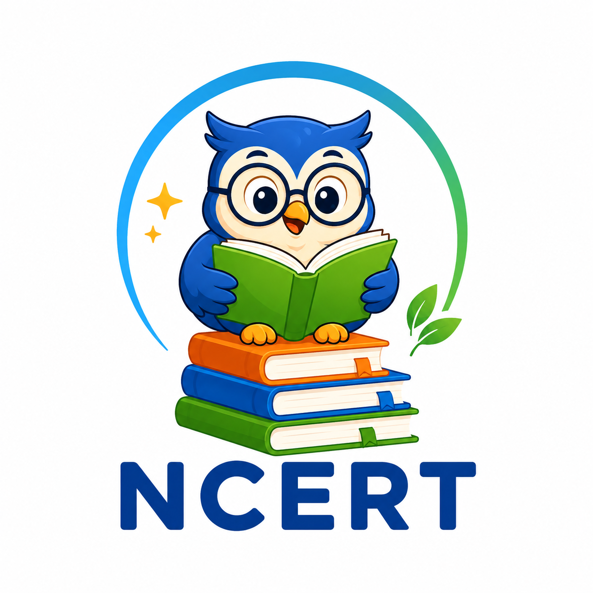

<div align="center">
  
  <h1>NCERT Books & Digital Reader</h1>
  <p><strong>A Modern, Cross-Platform Educational Digital Reader and Gamified Learning Management System built with Flutter.</strong></p>
  <p>Version 1.0.0</p>
</div>

---

## Overview

NCERT Books & Digital Reader is a cross-platform application designed for students from Class 1 through Class 12. It provides access to official NCERT textbooks, chapter PDF reading, offline access, progress tracking, and interactive study statistics across Mobile, Tablet, and Desktop environments.

The application features a modern Glassmorphic user interface, dark and light theme adaptation, responsive grid layouts, and automated daily learning mission tracking.

---

## Core Features

- **Complete NCERT Catalog Access**: Dynamic catalog covering Class 1 to Class 12 across Mathematics, Science, Social Science, English, Hindi, Sanskrit, and environmental subjects.
- **Glassmorphic Design System**: Custom translucency, frosted glass effects, subtle borders, and fluid animations tuned for performance across devices.
- **Cross-Platform Responsive Architecture**: Adapts dynamically from mobile phones to wide desktop laptop screens with custom grid layouts and side navigation rails.
- **Integrated PDF Reader Engine**: High-performance PDF viewing supporting multi-page navigation, paper theme customization (Day, Sepia, Night), local caching, and page bookmarking.
- **Guaranteed Offline Reliability**: Automated offline PDF generation engine ensuring content availability even without network connectivity.
- **Gamified Learning & Analytics**: Automated XP reward accumulation, daily reading streaks, level title progression, trophy badges, and mission tracking.
- **Theme Customization**: Real-time smooth switching between Dark Mode and Light Mode with system-wide state persistence.

---

## Technical Stack

| Component | Technology |
| :--- | :--- |
| **Framework** | Flutter (SDK ^3.12.2) |
| **Language** | Dart |
| **PDF Renderer** | `pdfrx` |
| **UI Design System** | Glassmorphism (`oc_liquid_glass`, Custom Painters) |
| **Typography** | `google_fonts` (Outfit, Plus Jakarta Sans) |
| **State & Persistence** | `ChangeNotifier`, `shared_preferences` |
| **Network & I/O** | `http`, `path_provider` |
| **Notifications** | `flutter_local_notifications`, `timezone` |

---

## Project Structure

```text
ncert_books_app/
├── assets/
│   ├── data.json                   # Official NCERT Catalog Data
│   └── logo.png                    # Official Application Logo
├── lib/
│   ├── models/                     # Data Models (NcertBook, PdfBookmark)
│   ├── screens/                    # Modular Application Screen Domains
│   │   ├── books/                  # Books Domain (bloc/, widgets/, screens)
│   │   │   ├── bloc/               # books_bloc.dart, books_event.dart, books_state.dart
│   │   │   └── widgets/            # book_card.dart
│   │   ├── explore/                # Catalog Search Domain (bloc/, widgets/, screens)
│   │   │   ├── bloc/               # explore_bloc.dart, explore_event.dart, explore_state.dart
│   │   │   └── widgets/            # subject_card.dart, subject_chip.dart
│   │   ├── home/                   # Dashboard & Navigation Domain (bloc/, widgets/, screens)
│   │   │   ├── bloc/               # home_bloc.dart, home_event.dart, home_state.dart
│   │   │   └── widgets/            # hero_player_card.dart, daily_mission_card.dart, reward_chest_widget.dart, streak_header.dart
│   │   ├── onboarding/             # Onboarding Setup Domain (bloc/, screens)
│   │   │   └── bloc/               # onboarding_bloc.dart, onboarding_event.dart, onboarding_state.dart
│   │   ├── profile/                # Profile & Settings Domain (bloc/, screens)
│   │   │   └── bloc/               # profile_bloc.dart, profile_event.dart, profile_state.dart
│   │   ├── progress/               # Learning Analytics Domain (bloc/, widgets/, screens)
│   │   │   ├── bloc/               # progress_bloc.dart, progress_event.dart, progress_state.dart
│   │   │   └── widgets/            # achievement_badge_card.dart, learning_journey_widget.dart, subject_world_card.dart
│   │   └── reader/                 # PDF Reader Engine Domain (bloc/, screens)
│   │       └── bloc/               # pdf_reader_bloc.dart, pdf_reader_event.dart, pdf_reader_state.dart
│   ├── services/                   # Business Logic & Data Providers
│   │   ├── gamification_service.dart
│   │   ├── ncert_repository.dart
│   │   ├── pdf_cache_service.dart
│   │   └── notification_service.dart
│   ├── theme/                      # Responsive Breakpoints & Glass Theme System
│   └── widgets/                    # Shared UI System (glass/, liquid/, painters/)
└── pubspec.yaml                    # Application Dependencies & Assets Configuration
```

---

## Installation & Setup

### Prerequisites

- Flutter SDK (version 3.12.0 or higher)
- Dart SDK
- Android Studio / VS Code with Flutter extension
- Windows C++ Build Tools (for Windows Desktop builds)

### Installation Steps

1. **Clone the Repository**:
   ```bash
   git clone https://github.com/Swayanshuu/NCERT-App.git
   cd NCERT-App
   ```

2. **Install Dependencies**:
   ```bash
   flutter pub get
   ```

3. **Run Application**:

   - **Windows Desktop**:
     ```bash
     flutter run -d windows
     ```

   - **Android Device / Emulator**:
     ```bash
     flutter run -d android
     ```

   - **Web Environment**:
     ```bash
     flutter run -d chrome
     ```

---

## Build Commands

To generate release binaries for distribution:

- **Android APK**:
  ```bash
  flutter build apk --release
  ```

- **Windows Desktop Application**:
  ```bash
  flutter build windows --release
  ```

- **Web Bundle**:
  ```bash
  flutter build web --release
  ```

---

## Author & Maintainer

- **Developer**: swayanshuuu
- **Email**: swayanshu19@gmail.com
- **Repository**: [https://github.com/Swayanshuu/NCERT-App](https://github.com/Swayanshuu/NCERT-App)